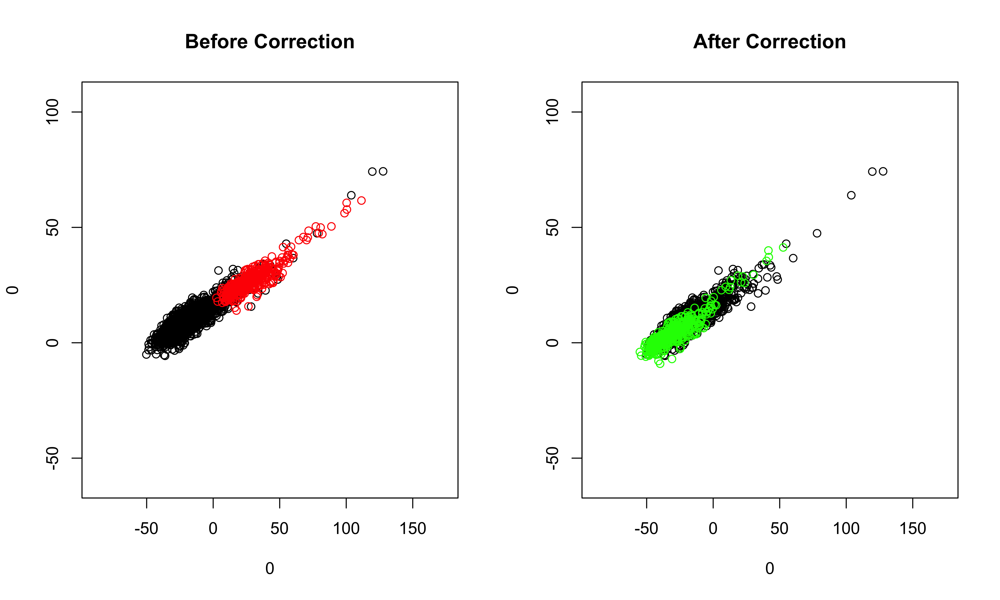

# Introduction
  
The `dmatch` algorithm allows batch effect removal for single cell RNA-Seq data. It comprises of three key components including: 
  
  1.  Dimension reduction; 
  2.  Identification of nearest neighbore across batches; and 
  3.  The adjustment of the datasets with unwanted variation using Gaussian kernel density estimation, KL-divergence and gradient desent algorithm. 
  
  
The purpose of this tutorial is to illustrate some uses of `dmatch` and explain its key components. 
  
# Loading Packages and Data
  
We will load the `dmatch` package. 
  
```{r eval=F}
suppressPackageStartupMessages({
  library(dmatch)
})
```
  

We selected HC1 PBMC sample (raw read count format) and SLE BMMC sample (raw read count format) for illustration in this tutorial. 
Warning: make sure that the cell names are consistent for fastSVD funtion and CreatedmatchObject.

```{r eval=F}
sample1<-read.csv(gzfile("HC1_PBMC.barcode_gene.csv.names.gz"), row.names = 1, header = T)
sample2<-read.csv(gzfile("SLE_BMMC.barcode_gene.csv.names.gz"), row.names = 1, header = T)
colnames(sample1)<-paste("sample1", colnames(sample1), sep = "_")
colnames(sample2)<-paste("sample2", colnames(sample2), sep = "_")
```


We use SVD to perform PCA for better computational efficiency. Prior to the step, we recommend filtering out genes expressed in less than 5% cells and cells with less than 200 genes expressed, this can be done by manually setting min.cells and min.genes.

By default, we employ a global-scaling normalization method “LogNormalize” that normalizes the feature expression measurements for each cell by the total expression, multiplies this by a scale factor (1000000), and log-transforms the result. 

```{r eval=F}
PCA<-fastSVD(list(sample1,sample2), min.cells = 3, min.genes = 200)
##This step will assign a batch id for each sample in a sequential order. The first sample provided in the list will have batch id as 1, and the sample sample will have batch id as 2, etc.
```

Inspect the PC plot of those samples:
```{r eval=F}
##If set the filename to be **NULL**, the PC plot will be only printed to the screen; otherwise, the plot will be saved to the specified path.
PCAPlot(PCA = PCA, PCs.to.plot = c(1,2), batchs.to.plot = c(1,2), filename = NULL)
```


Create a dmatch class object, which contains slots to store multiple types of information for the samples. The input for raw.data is a list of samples and the second element in that list will be used as the reference sample. Recommend to select the sample which has more cells as the reference sample. Here sample1 and sample2 are raw read count expression matrices.
```{r eval=F}
##batch.id here corresponds to the batch id assigned to each sample in **fastSVD** step.
##The first sample in the list will be to-be-corrected sample, the second sample in the list will be the reference sample.
samples<-CreatedmatchObject(raw.data = list(sample2,sample1), batch.id = c(2,1), PCA = PCA)
```


# Identifying nearest neighbors across batches

We introduce external information, a reference panel, which is composed of 95 primary cell lines and ~5000 genes to identify separate cell clusters in the samples. The reference panel is a 44 meta-analysis of a large number of publicly available microarray datasets. 

Those cell types in the reference panel do not necessarily represent the true biological cell types. The reference panel contains detailed and rich information to identify separate clusters in experimental datasets. Cells from different samples/batches which are highly correlated to the same cell type in the reference panel are the nearest neighbors across samples/batches.


Load the reference panel
We provided two versions of the reference panel which use different gene naming systems: cell.line.to.ensl.ID and cell_atlas_ref_panel
```{r eval=F}
path<-system.file("extdata", "cell_atlas_ref_panel", package = "dmatch")
##the above code will return the path of the desired reference panel, then use the following code to load the desired reference panel.
load(path)
```

```{r eval=F}
##project the cells in the samples to the reference panel
samples<-projection_to_reference_panel(samples,Reference = cell.line,use.genes.threshold = 0.75)
##visualize the projection result: recommended hclust method include: complete, ward.D, ward.D2
samples<-projection_visualization(samples,hclust.method = "ward.D")
```


We then cut the clusters into separate cell types and select some clusters to study batch effects based on the number of cells in those clusters (ideally, no less than **5% of the total number of cells in that sample**) and the shapiro test results (**lower/lowest shapiro pvalue relatively**) of those clusters.

```{r eval=F}
##there are three major cell types in the visualization plot of the projection result 
samples<-cut_groups(samples,K=5, method = "ward.D")
##select clusters which have enough cells and which have low transformed shapiro pvalue; recomended quantile includes: 0.90,0.95,0.98
samples<-select_clusters(samples, quantile = 0.98)
##the results will be stored in select.clusters slot
```

To inspect the cell numbers of each cluster and the result of shapiro test:
```{r eval=F}
samples@select.clusters$cells.num
samples@select.clusters$shapiro.test.pvalue
```


We would select cell cluster 3 and 4 as the reference clusters.


# Batch effects correction

```{r eval=F}
##batch effects correction: recommended quantile includes: 0.90,0.95,0.98
samples<-run_alignment_by_2D(samples, selected = c(3,4), quantile = 0.98)

When the quantile is too high, the following error will be returned:
quantile must be at most %d
The solution is to lower the quantile.

##visualize the corrected data, selecting PC1 and PC2, and all cell clusters in the samples
plot_corrected(samples, pcs.plot = c(1:2), celltypes.plot = c(1,2,3,4,5))
##also can inspect the corrected data selecting less cell clusters
plot_corrected(samples, pcs.plot = c(1:2), celltypes.plot = c(3))
##if we set the filename to be **NULL**, then the plots before correction and after correction will be printed on the screen directly. 
```




Once we are satisfied with the results of batch effects correction in the previous step, we now move the low-dimensional data in PC space to the original high-dimensional space. The corrected sample and the reference sample are stored in the **outcome.list** slot of the object. 
```{r eval=F}
samples<-move_back_to_original_space(samples)
```
